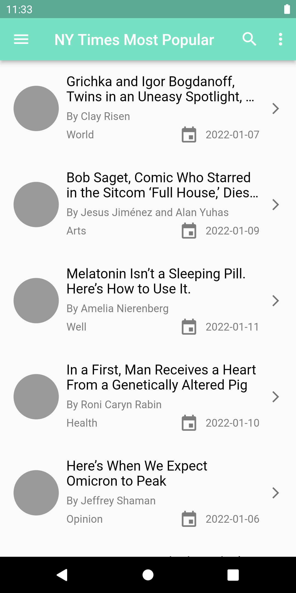

# Ny Times Most Popular Articles

This is a simple app to hit the NY Times Most Popular Articles API and show a list of articles, that shows details when items on the list are tapped.

## Description

This id flutter project For NY Times Most Popular Articles App.

This app show the articles given by NY Times Most Popular Articles Free API, And the steps shown below : 
 1- You can start from this url[ NY Times API ](https://developer.nytimes.com/apis) 
 2- Sign In with you email and if you don't have an account sign up a new account.
 3- Create new app by click on your profile then click APPs then create a new one (inter the name of your project and description and detect which api wou will use and in our app we user Most Popular API then click save ).
 4- After create app you will see api key you should copy it or generate a new one.
 5- Paste your api-key instead of kYourApiKey static variable in contants file (I will keep my api-key so you can see the output).
 
 ## Features 
 - using [Bloc](https://bloclibrary.dev/) for state management.
 - using [Get-it](https://pub.dev/packages/get_it) as a Service Locator for dependency injection.
 - using [Dio](https://pub.dev/packages/dio) as networking library for Http client for Dart.
 - Object Oriented Programming approach.

 ## Screenshots 

    

